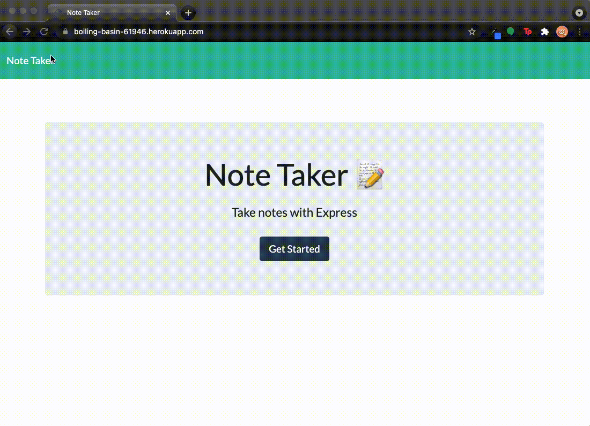
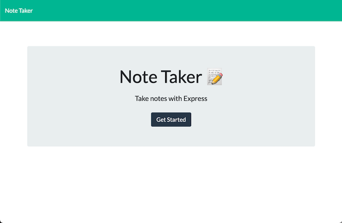
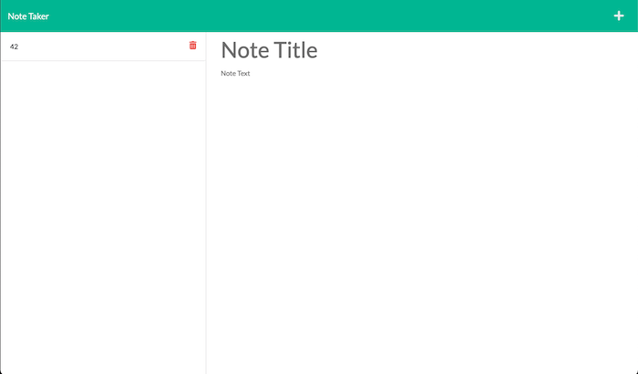

# 011-ExpressJsNoteTaker

The Express Note Taker Is an app that uses Express to save, retrieve and delete data from JSON file. Any user can use this as their personal note taking app for their daily use to capture information to all devices with text. 

The App is also being run in (Heroku)[https://dashboard.heroku.com/] link homework below. 

## Table of Contents
- [About The Homework](#about-the-homework)
- [Installation](#installation)
- [Usage](#usage)
- [License](#license)

## About The Homework

- The Express Note Taker will be using the Router(). to create chainable route handlers by using app.router(). The router will be mainly used for HTML and API Routes. 
- The Express Server will be using the port: 3001 or go to the live (link)[https://boiling-basin-61946.herokuapp.com/]

## Usage 

- Go to [Github Link](https://github.com/Chabivz/011-ExpressJsNoteTaker) and clone the file. 
- [Github Page](https://chabivz.github.io/011-ExpressJsNoteTaker/)
- [Heroku Link](https://boiling-basin-61946.herokuapp.com/)
- To register and login in Heroku.
- Create the package.json by typing [npm init -y]
- In the 011-ExpressJsNoteTaker install all the packages by typing [npm i]
- Additional packages to install express [npm i express]
- To run the type [npm start]
- When clicked the Saved Icon, Array Note will be saved as an object in array.
- When clicked the Delete/Trash Icon, Note will be deleted. 

Express Note Taker Demo \ 
 \
Express Note Taker Default Page \ 
 \
Express Note Taker Page \ 
 \

## License 

The MIT License (MIT)

Copyright (c) 2015 Chris Kibble

Permission is hereby granted, free of charge, to any person obtaining a copy of this software and associated documentation files (the "Software"), to deal in the Software without restriction, including without limitation the rights to use, copy, modify, merge, publish, distribute, sublicense, and/or sell copies of the Software, and to permit persons to whom the Software is furnished to do so, subject to the following conditions:

The above copyright notice and this permission notice shall be included in all copies or substantial portions of the Software.

THE SOFTWARE IS PROVIDED "AS IS", WITHOUT WARRANTY OF ANY KIND, EXPRESS OR IMPLIED, INCLUDING BUT NOT LIMITED TO THE WARRANTIES OF MERCHANTABILITY, FITNESS FOR A PARTICULAR PURPOSE AND NONINFRINGEMENT. IN NO EVENT SHALL THE AUTHORS OR COPYRIGHT HOLDERS BE LIABLE FOR ANY CLAIM, DAMAGES OR OTHER LIABILITY, WHETHER IN AN ACTION OF CONTRACT, TORT OR OTHERWISE, ARISING FROM, OUT OF OR IN CONNECTION WITH THE SOFTWARE OR THE USE OR OTHER DEALINGS IN THE SOFTWARE.